# P3 · Infraestructura 1 — Servidores en una DMZ con FortiGate

**Jose Gabriel Feliz Maria · Matrícula: 2025-0742**
**Seguridad de Redes · ITLA**

---

## 🎥 Video Demostrativo

**[Ver demostración en YouTube](PEGAR_AQUI_EL_LINK_DEL_VIDEO)** ⚠️ *(pendiente de grabar/subir)*

En el video se muestra la hora y fecha del sistema, el rostro y la voz del autor, y la demostración de que la topología cumple su objetivo de seguridad: los servidores están aislados en una DMZ, solo la VLAN 20 los administra por SSH, la VLAN 10 ve un aviso de bloqueo al entrar al Sistema de Inventario y la DMZ solo sale a Internet para actualizarse.

---

## 📋 Tabla de Contenido

1. [Propósito del Laboratorio](#1-propósito-del-laboratorio)
2. [Topología](#2-topología)
3. [Direccionamiento IP](#3-direccionamiento-ip)
4. [Decisiones de Diseño](#4-decisiones-de-diseño)
5. [Switches SW-A y SW-B: VLAN, DHCP y Seguridad Básica](#5-switches-sw-a-y-sw-b-vlan-dhcp-y-seguridad-básica)
6. [Servidores de la DMZ (Contenedores Docker)](#6-servidores-de-la-dmz-contenedores-docker)
7. [FortiGate: Red y DMZ (GUI)](#7-fortigate-red-y-dmz-gui)
8. [FortiGate: Objetos y Políticas (GUI)](#8-fortigate-objetos-y-políticas-gui)
9. [Web Filter: Bloqueo del Sistema de Inventario](#9-web-filter-bloqueo-del-sistema-de-inventario)
10. [Pruebas y Verificación](#10-pruebas-y-verificación)
11. [Problemas Encontrados y Soluciones](#11-problemas-encontrados-y-soluciones)
12. [Scripts y Running-Configs](#12-scripts-y-running-configs)
13. [Evidencias (Capturas)](#13-evidencias-capturas)
14. [Notas y Limitaciones del Laboratorio](#14-notas-y-limitaciones-del-laboratorio)

---

## 1. Propósito del Laboratorio

Proteger tres servidores (dos servidores web y uno de base de datos) colocándolos en una **zona desmilitarizada (DMZ)** detrás de un **FortiGate**, de forma que un servidor comprometido no pueda usarse para llegar a la red de los usuarios ni para salir libremente a Internet. Los objetivos de seguridad son:

1. **Servidores en una DMZ.** La LAN de los servidores (`/28`) está en un puerto propio del FortiGate con rol DMZ.
2. **Sin fuga de tráfico hacia la LAN.** Ningún servidor de la DMZ puede iniciar una conexión hacia las redes de usuarios.
3. **DMZ sin Internet abierto.** Los servidores solo pueden comunicarse en Internet con los *endpoints* de actualización de los servicios que usan, y con ningún otro destino.
4. **SSH solo desde la VLAN 20.** La VLAN 20 (administración) es la única que puede entrar por SSH a los servidores.
5. **VLAN 10 restringida al Sistema de Inventario.** El usuario de la VLAN 10 no puede abrir ese servidor web y **ve un aviso de que violó una política** cuando lo intenta.

Toda la configuración y demostración del FortiGate se hizo por **interfaz gráfica (GUI)**; solo el acceso inicial se hizo por consola. Los dos switches y los servidores se configuraron por CLI.

---

## 2. Topología

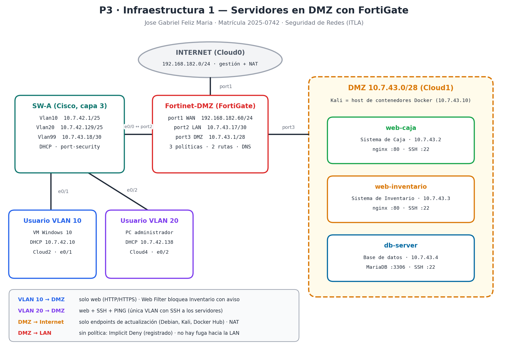

Topología montada en PNETLab:

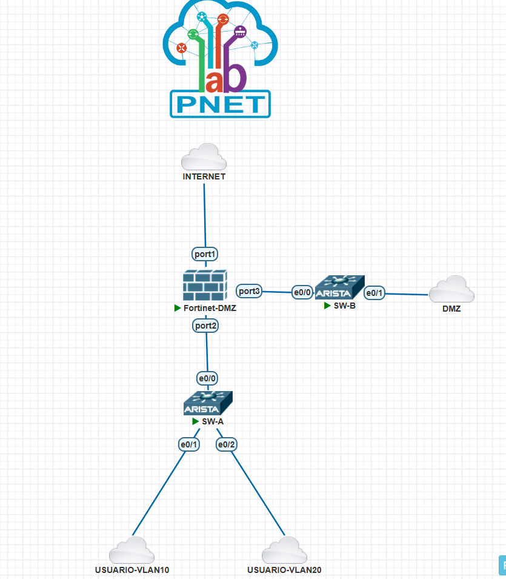

| Equipo | Rol |
|---|---|
| **Fortinet-DMZ** | FortiGate: separa Internet, la LAN de usuarios y la DMZ, y aplica todas las políticas |
| **SW-A** | Switch Cisco IOL de los usuarios: VLAN 10 y VLAN 20, sus gateways, DHCP y seguridad básica |
| **SW-B** | Switch Cisco IOL de la DMZ: VLAN 30 de los servidores y seguridad básica |
| **DMZ (Cloud1)** | Red de la DMZ: el Kali (host de contenedores) con los 3 servidores, conectado al SW-B |
| **web-caja** | Web Server: Sistema de Caja |
| **web-inventario** | Web Server: Sistema de Inventario |
| **db-server** | DB Server (MariaDB) |
| **USUARIO-VLAN10 (Cloud2)** | VM Windows 10, usuario normal |
| **USUARIO-VLAN20 (Cloud4)** | PC del administrador |
| **INTERNET (Cloud0)** | Salida a Internet (NAT de VMware) y red de gestión del FortiGate |

---

## 3. Direccionamiento IP

Direccionamiento basado en la matrícula **2025-0742**: `10.7.42.0/24` para los usuarios y `10.7.43.0/27` para la DMZ y el enlace.

| Red | Subred | Gateway | Uso |
|---|---|---|---|
| VLAN 10 – Usuarios | `10.7.42.0/25` | `10.7.42.1` (SW-A) | DHCP `10.7.42.10 – 10.7.42.126` |
| VLAN 20 – Administración | `10.7.42.128/25` | `10.7.42.129` (SW-A) | DHCP `10.7.42.138 – 10.7.42.254` |
| DMZ – Servidores (VLAN 30 en SW-B) | `10.7.43.0/28` | `10.7.43.1` (FortiGate) | Servidores `.2`, `.3`, `.4` · host Docker `.10` · SW-B `.11` |
| Enlace FortiGate ↔ SW-A | `10.7.43.16/30` | — | FortiGate `.17` · SW-A `.18` |
| Internet / gestión | `192.168.182.0/24` | `192.168.182.2` | port1 del FortiGate `.60` |

| Equipo | Interfaz | IP |
|---|---|---|
| Fortinet-DMZ | port1 (WAN_INTERNET) | `192.168.182.60/24` |
| Fortinet-DMZ | port2 (LAN_USUARIOS) | `10.7.43.17/30` |
| Fortinet-DMZ | port3 (DMZ_SERVIDORES) | `10.7.43.1/28` |
| SW-A | Vlan10 · Vlan20 · Vlan99 | `10.7.42.1/25` · `10.7.42.129/25` · `10.7.43.18/30` |
| SW-B | Vlan30 (gestión) | `10.7.43.11/28` |
| web-caja | eth0 | `10.7.43.2/28` |
| web-inventario | eth0 | `10.7.43.3/28` |
| db-server | eth0 | `10.7.43.4/28` |
| Kali (host Docker) | eth1 | `10.7.43.10/28` |
| VM Windows 10 (VLAN 10) | Ethernet1 | DHCP `10.7.42.10/25` |
| PC administrador (VLAN 20) | VMnet8 | DHCP `10.7.42.138/25` |

---

## 4. Decisiones de Diseño

La licencia de evaluación de FortiGate VM permite como máximo **3 interfaces, 3 políticas de firewall y 3 rutas**, y las interfaces VLAN también cuentan. El diseño se ajustó a ese límite sin dejar ningún requisito fuera:

| Recurso | Límite | Uso en este laboratorio |
|---|---|---|
| Interfaces | 3 | port1 (Internet + gestión) · port2 (usuarios) · port3 (DMZ) |
| Políticas | 3 | VLAN 10 → DMZ · VLAN 20 → DMZ · DMZ → actualizaciones |
| Rutas | 3 | Ruta por defecto · ruta hacia las VLAN (2 en total) |

- **Las VLAN de los usuarios las enruta el SW-A.** Como el FortiGate no puede tener una interfaz por VLAN, el SW-A trabaja en capa 3: es el gateway y el servidor DHCP de la VLAN 10 y la VLAN 20, y envía todo hacia el FortiGate por un solo enlace. El FortiGate distingue cada VLAN por su red de origen.
- **Un switch por zona.** El SW-A atiende a los usuarios y el SW-B a los servidores de la DMZ. El SW-B trabaja solo en capa 2 y su único camino hacia otras redes es el port3 del FortiGate, así que no existe forma de llegar a la DMZ sin pasar por el firewall.
- **La protección contra fugas no gasta políticas.** No existe ninguna política desde la DMZ hacia la LAN, así que el *Implicit Deny* bloquea ese tráfico, y se activó su registro para poder demostrarlo.
- **El DNS no gasta políticas.** El FortiGate actúa como servidor DNS de la DMZ y de los usuarios.
- **Los usuarios no tienen salida a Internet.** La práctica no lo pide, y así las 3 políticas disponibles se dedican a los requisitos de seguridad.

---

## 5. Switches SW-A y SW-B: VLAN, DHCP y Seguridad Básica

La topología tiene dos switches Cisco, uno por zona. No hay ningún enlace entre ellos: todo lo que va de los usuarios a los servidores pasa por el FortiGate.

### 5.1 SW-A: switch de los usuarios (capa 3)

- **VLAN 10 (USUARIOS)** en `e0/1`, **VLAN 20 (ADMINISTRACION)** en `e0/2`, **VLAN 99 (ENLACE-FORTIGATE)** en `e0/0` y **VLAN 999 (SIN-USO)** para el puerto libre.
- **Gateways (SVI) y ruteo:** `Vlan10 10.7.42.1/25`, `Vlan20 10.7.42.129/25`, `Vlan99 10.7.43.18/30` y ruta por defecto hacia el FortiGate (`10.7.43.17`).
- **DHCP** para las dos VLAN, con el FortiGate como DNS.
- **Seguridad básica:**
  - **Port-security** en los puertos de usuario (máximo 3 MAC, *sticky*, violación *restrict*).
  - **PortFast** y **BPDU Guard** en los puertos de usuario.
  - Puerto sin uso (`e0/3`) en la VLAN 999 y apagado.
  - `enable secret`, `service password-encryption`, banner y contraseña de consola.
  - Administración remota solo por **SSH v2**, con usuario local y **solo desde la VLAN 20** (`access-class 20`).

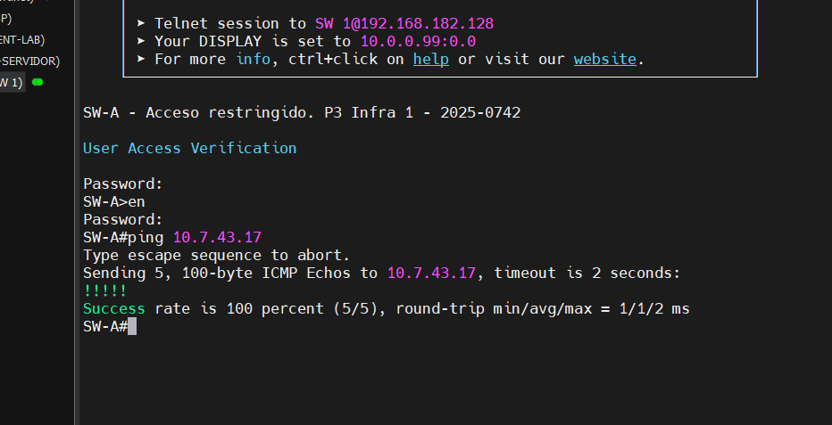

Script: [`scripts/SW-A_config.txt`](scripts/SW-A_config.txt)

### 5.2 SW-B: switch de la DMZ (capa 2)

- **VLAN 30 (SERVIDORES-DMZ)** en `e0/0` (enlace al port3 del FortiGate) y `e0/1` (servidores), y **VLAN 999 (SIN-USO)** para los puertos libres.
- **Solo capa 2:** el enrutamiento está apagado (`no ip routing`).
- **Gestión:** `Vlan30 10.7.43.11/28`, con el FortiGate como gateway.
- **Seguridad básica:**
  - **Port-security** en el puerto de los servidores (máximo 10 MAC, violación *restrict*). Por ese puerto llegan el host de contenedores y los tres servidores, cada uno con su propia MAC. Las direcciones se aprenden de forma dinámica y caducan a los 10 minutos de inactividad (ver el problema 11.6).
  - **PortFast** y **BPDU Guard** en el puerto de los servidores.
  - Puertos sin uso (`e0/2` y `e0/3`) en la VLAN 999 y apagados.
  - `enable secret`, `service password-encryption`, banner, contraseña de consola y servidor HTTP desactivado.
  - Administración remota solo por **SSH v2**, con usuario local y **solo desde la VLAN 20** (`access-class 20`). Ese acceso además tiene que pasar por la política `VLAN20_ADMIN_DMZ` del FortiGate.

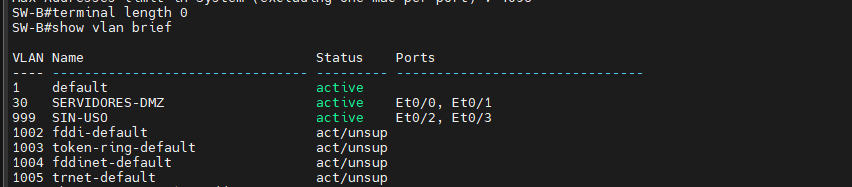

El SW-B llega al FortiGate, al host y a los tres servidores, y el puerto de los servidores tiene aprendidas sus cuatro direcciones:

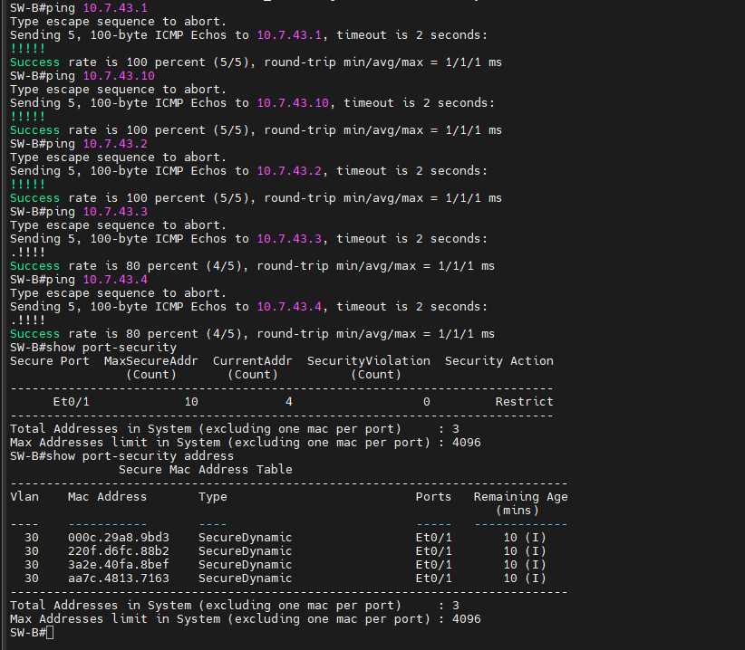

Desde la VLAN 20 (administración) responden un servidor y el propio SW-B, pasando por el FortiGate:

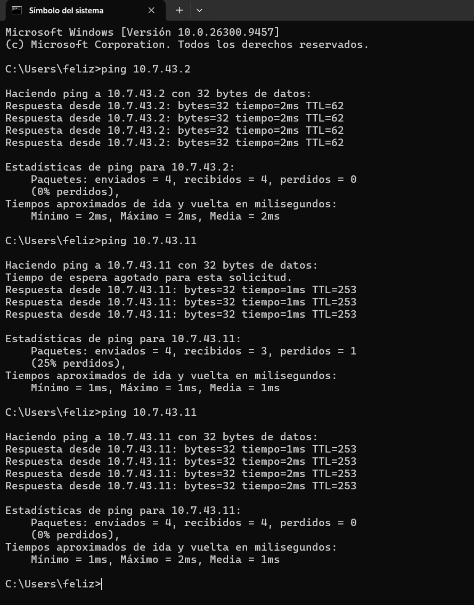

Script: [`scripts/SW-B_config.txt`](scripts/SW-B_config.txt)

---

## 6. Servidores de la DMZ (Contenedores Docker)

Los tres servidores son **contenedores Docker** que corren en el Kali, que está conectado a la DMZ (VMnet2 → Cloud1 → SW-B → port3 del FortiGate). Se usa una red Docker de tipo **macvlan** sobre la interfaz `eth1` del Kali, así que cada contenedor tiene **su propia IP y su propia MAC** en la red de la DMZ: para el FortiGate son tres servidores independientes.

| Servidor | IP | Servicios | Imagen |
|---|---|---|---|
| **web-caja** | `10.7.43.2` | nginx (HTTP 80) · OpenSSH (22) | `srv-web-0742` (Debian 12) |
| **web-inventario** | `10.7.43.3` | nginx (HTTP 80) · OpenSSH (22) | `srv-web-0742` (Debian 12) |
| **db-server** | `10.7.43.4` | MariaDB (3306) · OpenSSH (22) | `srv-db-0742` (Debian 12) |

- Gateway y DNS de los tres: `10.7.43.1` (FortiGate).
- Cada servidor tiene un usuario `admin` para SSH; el `db-server` tiene la base de datos `empresa_0742` con las tablas `productos` y `ventas`.
- La contraseña del usuario `admin` se pide al ejecutar el script y no se guarda en el repositorio.

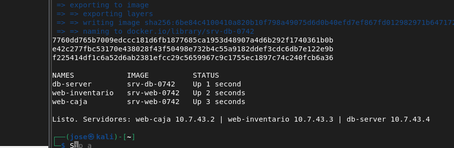

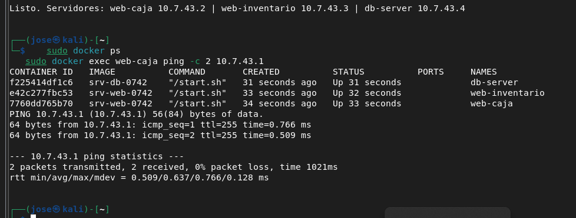

Scripts: [`scripts/kali_red_docker_y_repositorio.sh`](scripts/kali_red_docker_y_repositorio.sh) · [`scripts/kali_preparar_servidores_dmz.sh`](scripts/kali_preparar_servidores_dmz.sh)

---

## 7. FortiGate: Red y DMZ (GUI)

Acceso inicial por consola: [`scripts/Fortinet-DMZ_acceso_inicial_CLI.txt`](scripts/Fortinet-DMZ_acceso_inicial_CLI.txt). Todo lo demás por GUI:

| Paso (GUI) | Configuración |
|---|---|
| System → Settings | Hostname `Fortinet-DMZ`, zona horaria GMT-4, NTP |
| Network → DNS | `8.8.8.8` / `8.8.4.4` |
| Network → Interfaces → port1 | `WAN_INTERNET` · Role **WAN** · `192.168.182.60/24` · HTTP/HTTPS/PING/SSH (gestión) |
| Network → Interfaces → port2 | `LAN_USUARIOS` · Role **LAN** · `10.7.43.17/255.255.255.252` · solo PING |
| Network → Interfaces → port3 | `DMZ_SERVIDORES` · Role **DMZ** · `10.7.43.1/255.255.255.240` · solo PING |
| Network → Static Routes | `0.0.0.0/0` → `192.168.182.2` (port1) · `10.7.42.0/24` → `10.7.43.18` (port2) |
| Network → DNS Servers | Servicio DNS en port2 y port3, modo *Forward to System DNS* |

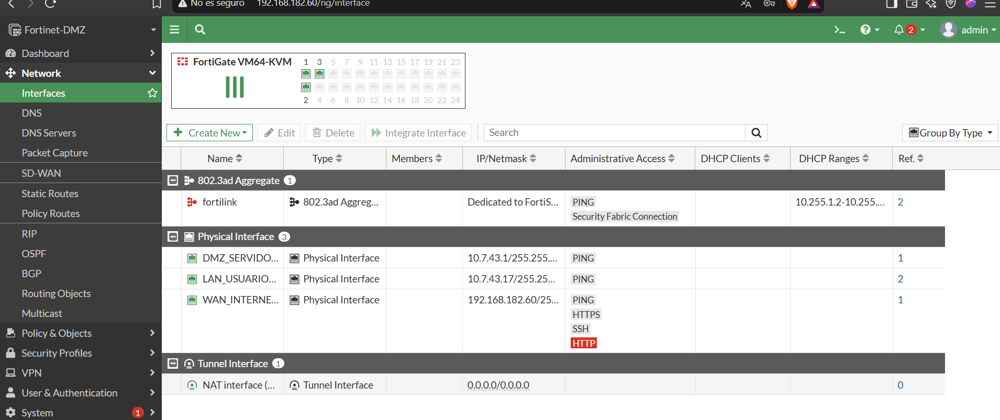

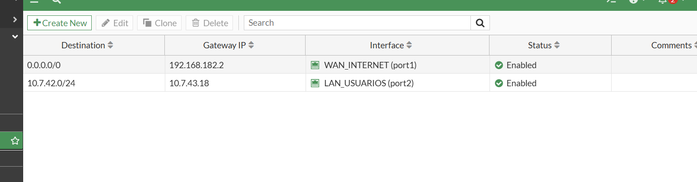

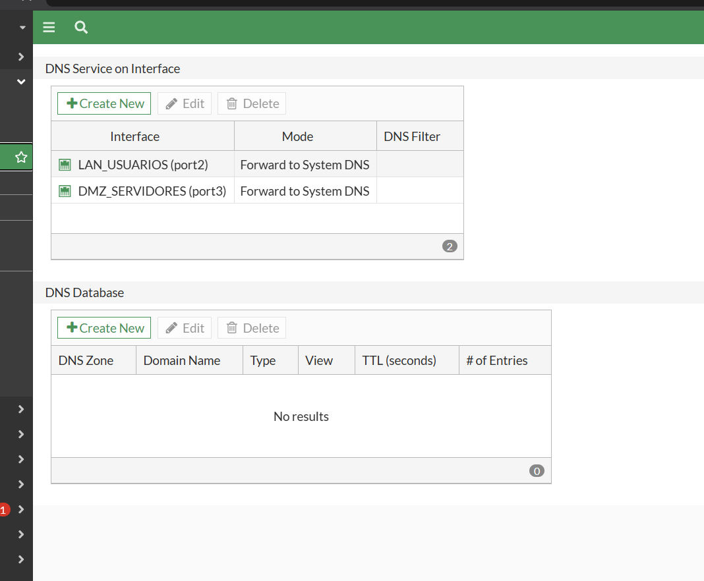

---

## 8. FortiGate: Objetos y Políticas (GUI)

### 8.1 Direcciones

| Objeto | Tipo | Valor |
|---|---|---|
| `VLAN10_USUARIOS` | Subnet | `10.7.42.0/25` |
| `VLAN20_ADMIN` | Subnet | `10.7.42.128/25` |
| `RED_DMZ` | Subnet | `10.7.43.0/28` |
| `WEB_CAJA` · `WEB_INVENTARIO` · `DB_SERVER` | Subnet | `10.7.43.2/32` · `10.7.43.3/32` · `10.7.43.4/32` |
| `UPD_DEBIAN` | FQDN | `deb.debian.org` |
| `UPD_KALI` | FQDN | `kali.download` |
| `UPD_DOCKER_REGISTRY` · `UPD_DOCKER_AUTH` · `UPD_DOCKER_CDN` | FQDN | `registry-1.docker.io` · `auth.docker.io` · `production.cloudflare.docker.com` |
| `ENDPOINTS_ACTUALIZACION` | Grupo | Los cinco objetos `UPD_...` |

Los *endpoints* de actualización corresponden a los servicios que usa la DMZ: los paquetes de nginx, MariaDB y OpenSSH de los servidores vienen de `deb.debian.org`; el host de contenedores se actualiza desde `kali.download`; y las imágenes de los contenedores vienen de Docker Hub.

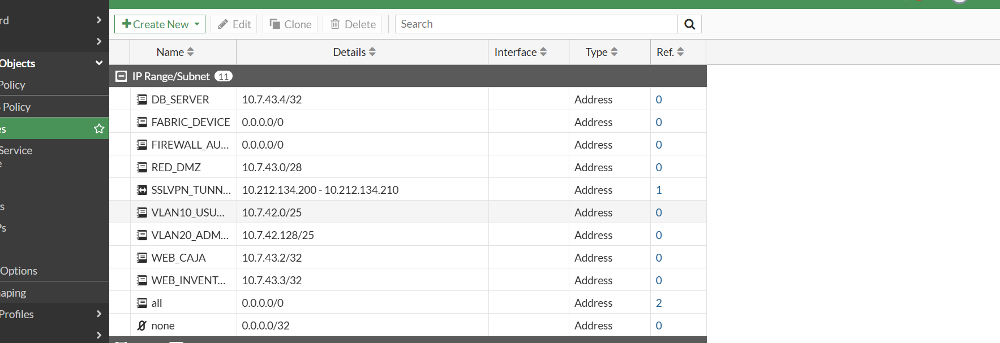

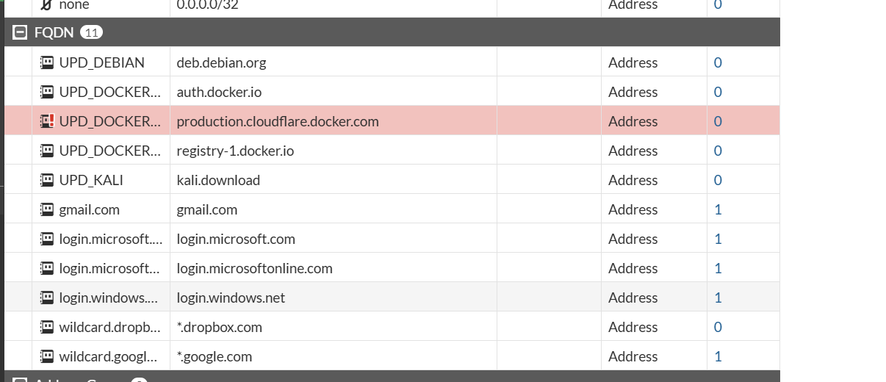

### 8.2 Políticas

| Política | Origen → Destino | Direcciones | Servicio | NAT | Perfiles |
|---|---|---|---|---|---|
| `VLAN10_WEB_DMZ` | port2 → port3 | `VLAN10_USUARIOS` → `WEB_CAJA`, `WEB_INVENTARIO` | HTTP, HTTPS | No | **Web Filter** `WF_BLOQUEO_INVENTARIO` |
| `VLAN20_ADMIN_DMZ` | port2 → port3 | `VLAN20_ADMIN` → `RED_DMZ` | HTTP, HTTPS, **SSH**, PING | No | — |
| `DMZ_SOLO_ACTUALIZACIONES` | port3 → port1 | `RED_DMZ` → `ENDPOINTS_ACTUALIZACION` | HTTP, HTTPS | Sí | — |
| *Implicit Deny* | cualquiera | todo lo demás | ALL | — | **Log Violation Traffic** activado |

Las tres políticas registran todas las sesiones. Cómo cubre cada requisito:

- **Sin fuga hacia la LAN:** no hay ninguna política port3 → port2. Todo lo que un servidor intente hacia las VLAN cae en el *Implicit Deny* y queda registrado.
- **DMZ sin Internet abierto:** la única salida de la DMZ es `DMZ_SOLO_ACTUALIZACIONES`, limitada a los *endpoints* de actualización.
- **SSH solo desde la VLAN 20:** el servicio SSH solo aparece en `VLAN20_ADMIN_DMZ`.
- **VLAN 10 restringida:** solo tiene web, y el Web Filter bloquea el Sistema de Inventario.

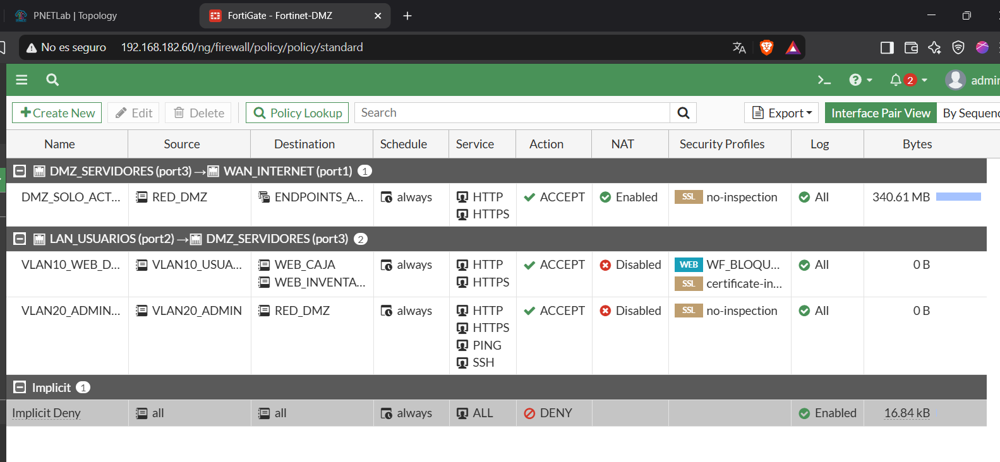

---

## 9. Web Filter: Bloqueo del Sistema de Inventario

Una política con acción *Deny* descartaría el tráfico en silencio y el usuario solo vería un error de conexión. Para que **presencie que violó una política**, el acceso al Sistema de Inventario se bloquea con un perfil de **Web Filter**, que responde con la página de bloqueo del FortiGate.

**Security Profiles → Web Filter → `WF_BLOQUEO_INVENTARIO`** (Flow-based):

| Parámetro | Valor |
|---|---|
| FortiGuard Category Based Filter | Desactivado (no depende de licencia) |
| Static URL Filter → URL Filter | URL `10.7.43.3` · Type *Simple* · Action **Block** |

El perfil se aplica solo en la política `VLAN10_WEB_DMZ`, así que la VLAN 20 no se ve afectada.

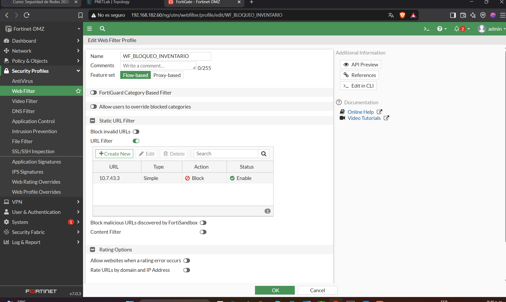

---

## 10. Pruebas y Verificación

| # | Requisito | Prueba | Resultado |
|---|---|---|---|
| 1 | DHCP en las VLAN | `ipconfig` en los dos usuarios | ✅ VLAN 10 `10.7.42.10` · VLAN 20 `10.7.42.138` |
| 2 | VLAN 20 administra | `ping` y web a `10.7.43.2` y `10.7.43.3` | ✅ Responde y abren los dos sistemas |
| 3 | **SSH solo VLAN 20** | `ssh admin@10.7.43.2` y `ssh admin@10.7.43.4` desde la VLAN 20 | ✅ Entra a los servidores |
| 4 | DB Server | Consulta `SELECT * FROM empresa_0742.productos` | ✅ Devuelve la tabla |
| 5 | **SSH solo VLAN 20** | `ssh admin@10.7.43.2` desde la VLAN 10 | ✅ *Connection timed out* |
| 6 | VLAN 10 usa Caja | `http://10.7.43.2` desde la VLAN 10 | ✅ Abre el Sistema de Caja |
| 7 | **VLAN 10 restringida al Inventario** | `http://10.7.43.3` desde la VLAN 10 | ✅ **Página de bloqueo del FortiGate** |
| 8 | **Sin fuga hacia la LAN** | `ping 10.7.42.10` desde `web-caja` | ✅ 100% de pérdida |
| 9 | **DMZ solo actualizaciones** | `apt-get update` en `web-caja` y `apt update` en el Kali | ✅ Descargan de `deb.debian.org` y `kali.download` |
| 10 | **DMZ sin Internet abierto** | `curl https://www.google.com` desde `web-caja` | ✅ *Connection timed out* |
| 11 | Registro | Log & Report → Forward Traffic | ✅ Bloqueos registrados como *Deny: policy violation* |
| 12 | Switch de la DMZ | `ping` desde SW-B al FortiGate, al host y a los tres servidores | ✅ Responden todos |
| 13 | Switch de la DMZ administrado desde la VLAN 20 | `ping 10.7.43.11` desde la VLAN 20 | ✅ Responde, pasando por el FortiGate |

### VLAN 20 (administración): web y SSH a los servidores

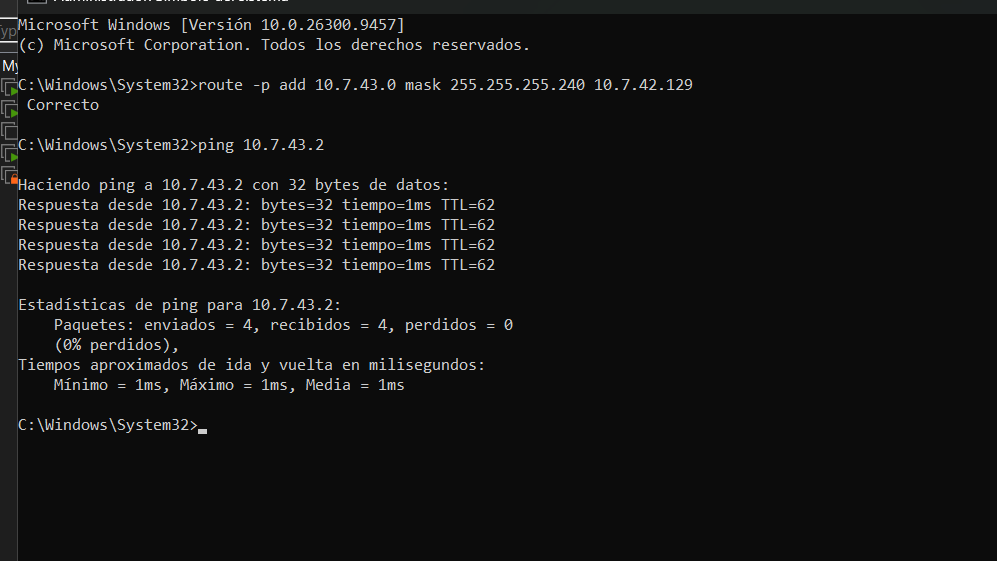

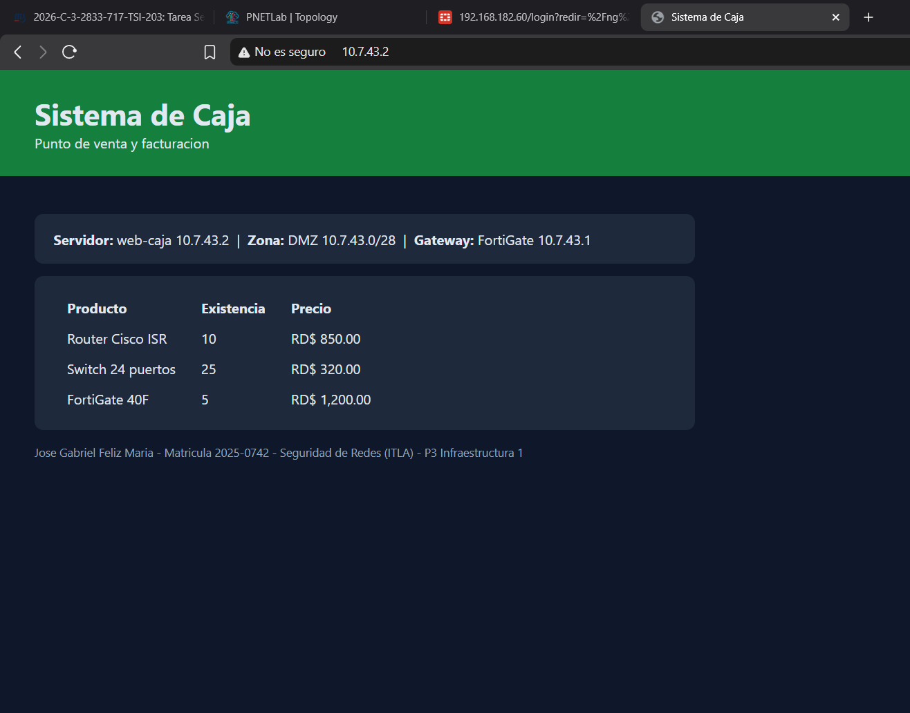

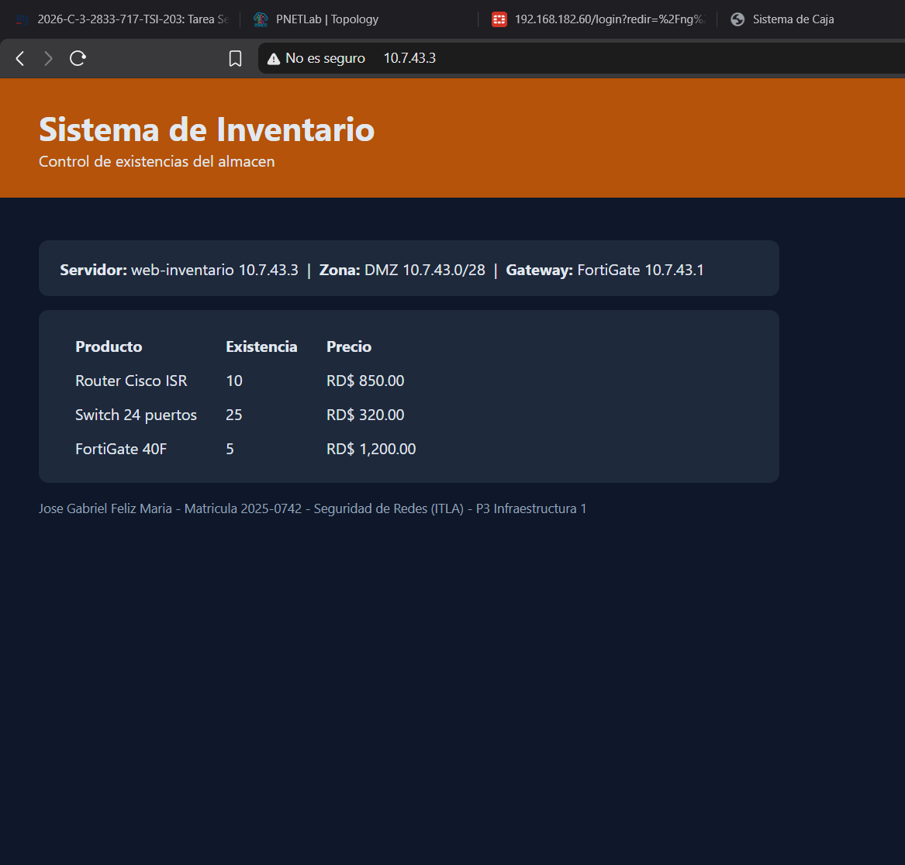

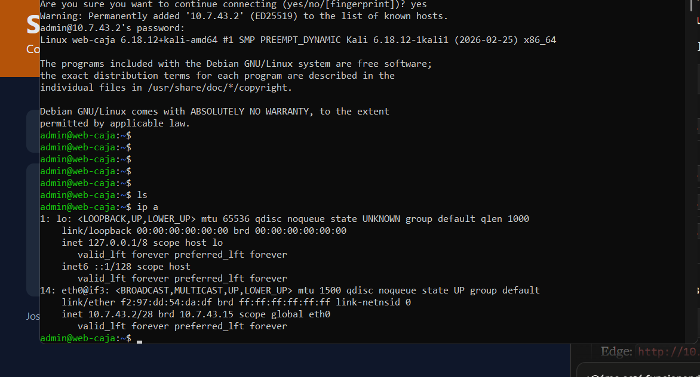

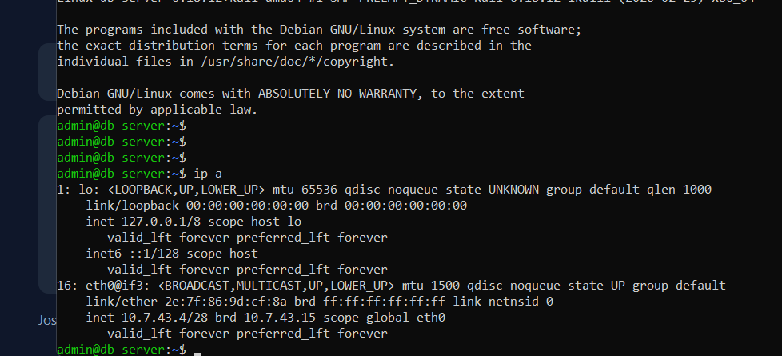

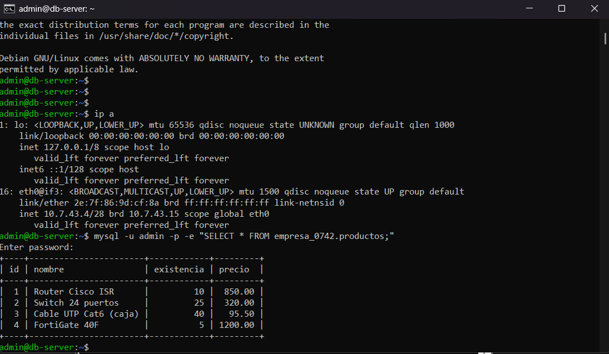

### VLAN 10 (usuario): solo Caja, Inventario bloqueado y sin SSH

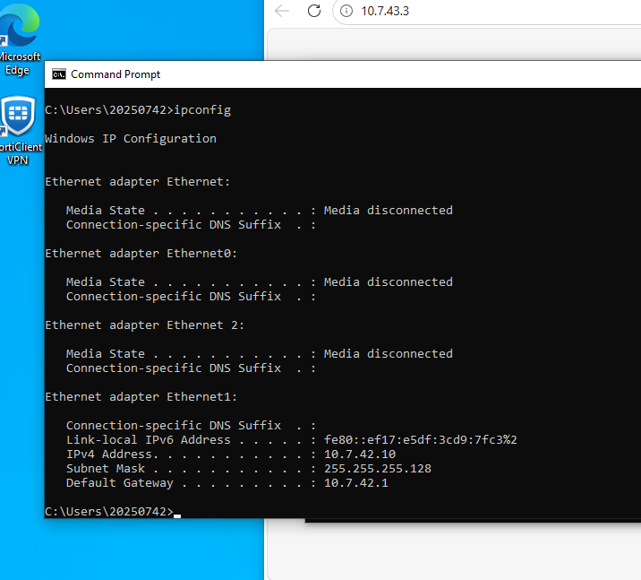

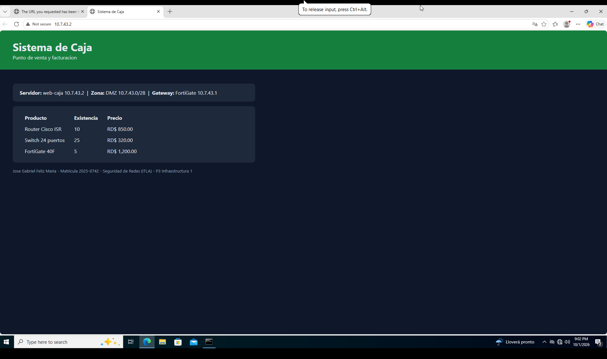

**El usuario ve que violó una política:** el FortiGate responde con *Web Page Blocked*, la URL bloqueada y el motivo (*Local URLfilter Block*).

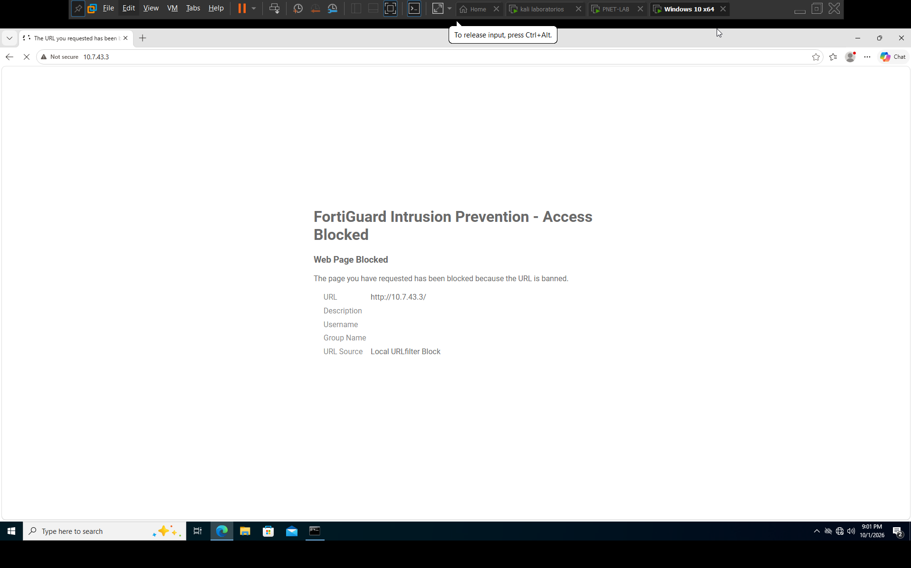

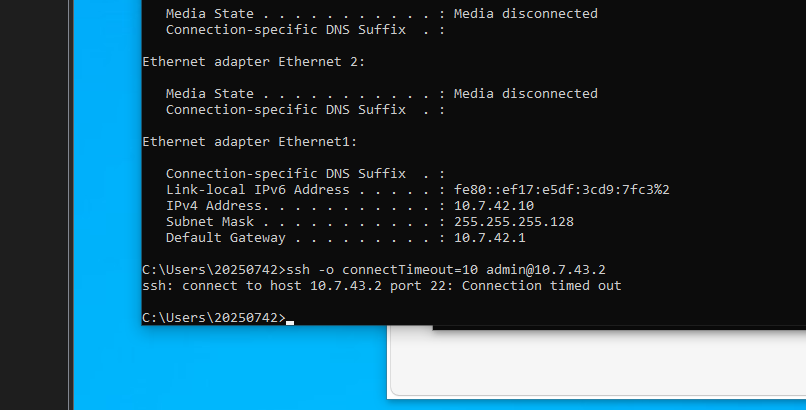

### DMZ: sin fuga hacia la LAN y solo actualizaciones

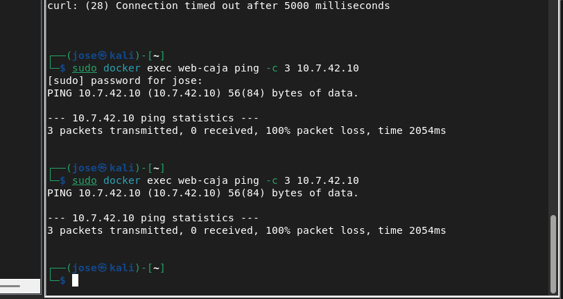

`apt update` (Kali) y `apt-get update` (servidor) funcionan; `curl` hacia Google termina en *timeout*.

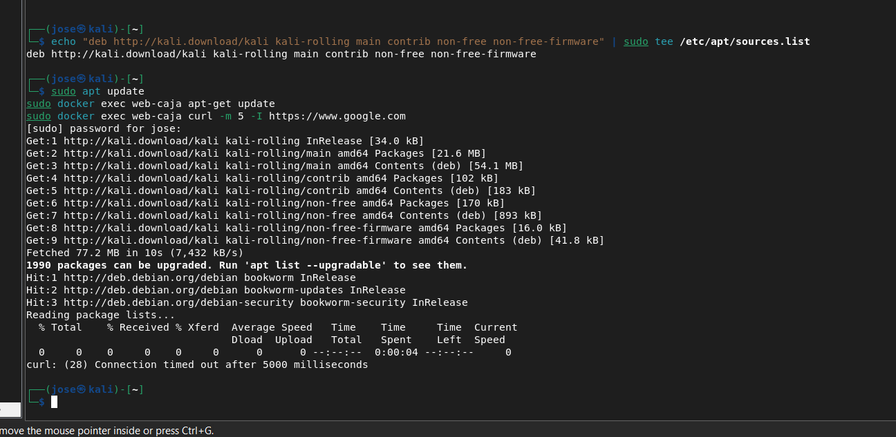

### Registros del FortiGate

Los intentos fuera de las políticas (usuarios de la VLAN 10 o el host de la DMZ hacia Internet) quedan como *Deny: policy violation* con el *Policy ID 0* (Implicit Deny).

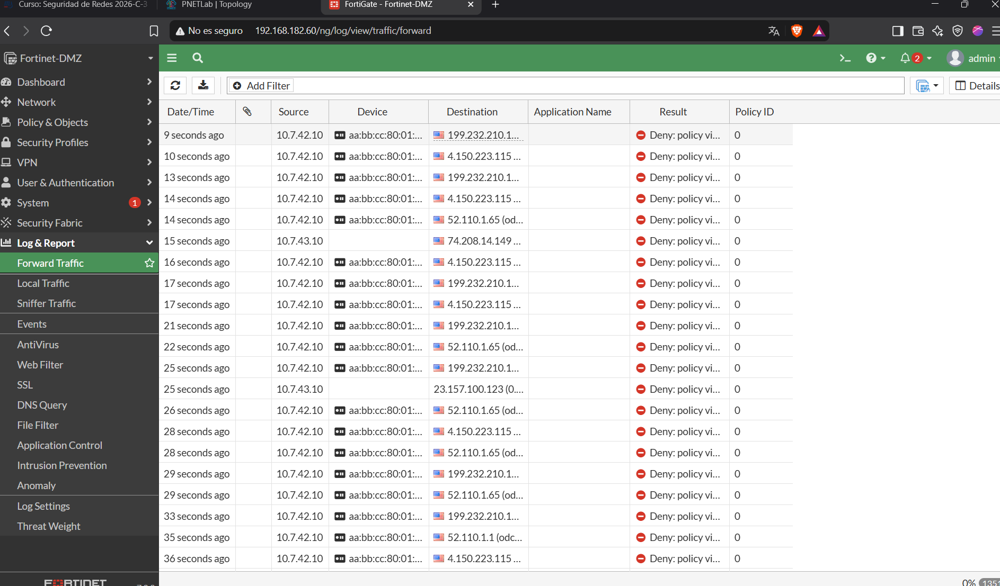

---

## 11. Problemas Encontrados y Soluciones

### 11.1 La DMZ no podía instalar nada

Al preparar el Kali, `apt` resolvía los nombres (el FortiGate ya era su DNS) pero las descargas terminaban en *timeout*, porque todavía no existía ninguna política de salida para la DMZ. **Solución:** se creó la política DMZ → Internet y, una vez instalados Docker y los contenedores, se restringió su destino al grupo `ENDPOINTS_ACTUALIZACION`.

### 11.2 `http.kali.org` no se puede permitir por FQDN

El repositorio por defecto de Kali (`http.kali.org`) redirige cada descarga a un espejo distinto, así que no hay un destino fijo que permitir en el FortiGate. **Solución:** se configuró el Kali con el repositorio `kali.download`, que siempre responde desde el mismo nombre.

### 11.3 El usuario de la VLAN 10 entraba por SSH

En la primera prueba, el SSH desde la VM Windows 10 **sí entraba** a los servidores. La VM tenía conectado un segundo adaptador de red con salida a Internet, y su tráfico salía por ahí en lugar de pasar por el SW-A como VLAN 10. **Solución:** se desconectó ese adaptador en VMware; con la VM solo en la VLAN 10, el SSH quedó bloqueado (*Connection timed out*).

### 11.4 El navegador cambiaba a HTTPS

Edge convertía la dirección a `https://` y los servidores web solo publican HTTP (puerto 80), por lo que aparecía *connection refused*. **Solución:** escribir la dirección completa con `http://`.

### 11.5 El Web Filter no respondió en las primeras pruebas

Con el perfil recién aplicado, las conexiones de la VLAN 10 a los dos servidores web terminaban en *timeout* (ni Caja abría). Se revisaron la política y el perfil, que estaban correctos; en la siguiente sesión de pruebas el Web Filter ya respondía: Caja abre y el Inventario muestra la página de bloqueo.

### 11.6 Las MAC de los servidores cambian en cada arranque

Al configurar port-security en el SW-B se vio que Docker le da una MAC nueva a cada contenedor cada vez que arranca. Con direcciones *sticky*, las viejas se quedarían guardadas y, tras unos cuantos reinicios, el puerto llegaría a su máximo y el switch empezaría a descartar el tráfico de los servidores. **Solución:** en ese puerto las direcciones se aprenden de forma dinámica y caducan a los 10 minutos de inactividad (`aging type inactivity`); el límite de 10 direcciones se mantiene.

### 11.7 El SW-B no respondía a la VLAN 20

Desde la VLAN 20 los servidores respondían, pero el ping a la IP de gestión del SW-B se perdía. En esta imagen de Cisco el enrutamiento viene activado, y con él activado el switch ignora `ip default-gateway`, así que no sabía por dónde devolver la respuesta. **Solución:** `no ip routing`, que además deja al SW-B como un switch solo de capa 2.

---

## 12. Scripts y Running-Configs

| Archivo | Descripción |
|---|---|
| [`scripts/SW-A_config.txt`](scripts/SW-A_config.txt) | Configuración completa del switch SW-A (usuarios) |
| [`scripts/SW-B_config.txt`](scripts/SW-B_config.txt) | Configuración completa del switch SW-B (DMZ) |
| [`scripts/Fortinet-DMZ_acceso_inicial_CLI.txt`](scripts/Fortinet-DMZ_acceso_inicial_CLI.txt) | Acceso inicial por consola del FortiGate (IP de gestión) |
| [`scripts/kali_red_docker_y_repositorio.sh`](scripts/kali_red_docker_y_repositorio.sh) | Red del Kali en la DMZ, repositorio fijo e instalación de Docker |
| [`scripts/kali_preparar_servidores_dmz.sh`](scripts/kali_preparar_servidores_dmz.sh) | Crea las imágenes, la red macvlan y los 3 servidores (Dockerfiles, páginas web y base de datos incluidos) |
| [`running-configs/Fortinet-DMZ_running-config.conf`](running-configs/Fortinet-DMZ_running-config.conf) | Backup de configuración del FortiGate (GUI → Configuration → Backup) |
| [`running-configs/SW-A_running-config.txt`](running-configs/SW-A_running-config.txt) | Running-config del SW-A, con `show port-security` y `show ip dhcp binding` |
| [`running-configs/SW-B_running-config.txt`](running-configs/SW-B_running-config.txt) | Running-config del SW-B, con `show port-security` |
| [`running-configs/Kali_docker_estado.txt`](running-configs/Kali_docker_estado.txt) | Estado de los contenedores y de la red `dmz_net` |
| [`diagramas/gen_diagrama.py`](diagramas/gen_diagrama.py) | Script (Python + matplotlib) que genera el diagrama |

> En el backup del FortiGate se redactaron (`<REDACTADO>`) los hashes de contraseñas y las llaves privadas de los certificados, porque el repositorio es público. Las contraseñas de los switches son de laboratorio.

---

## 13. Evidencias (Capturas)

| # | Archivo | Descripción |
|---|---|---|
| 01 | [`01_topologia_pnetlab.png`](screenshots/01_topologia_pnetlab.png) | Topología en PNETLab |
| 02 | [`02_sw-a_ping_fortigate.png`](screenshots/02_sw-a_ping_fortigate.png) | El SW-A llega al FortiGate |
| 03 | [`03_fgt_interfaces.png`](screenshots/03_fgt_interfaces.png) | Interfaces: WAN, LAN y DMZ |
| 04 | [`04_fgt_rutas_estaticas.png`](screenshots/04_fgt_rutas_estaticas.png) | Rutas estáticas |
| 05 | [`05_kali_contenedores_creados.png`](screenshots/05_kali_contenedores_creados.png) | Creación de los 3 servidores |
| 06 | [`06_kali_docker_ps_ping_fortigate.png`](screenshots/06_kali_docker_ps_ping_fortigate.png) | Contenedores activos y ping al FortiGate |
| 07 | [`07_fgt_direcciones.png`](screenshots/07_fgt_direcciones.png) | Objetos de dirección |
| 08 | [`08_fgt_fqdn_actualizaciones.png`](screenshots/08_fgt_fqdn_actualizaciones.png) | Endpoints de actualización (FQDN) |
| 09 | [`09_kali_dmz_solo_actualizaciones.png`](screenshots/09_kali_dmz_solo_actualizaciones.png) | La DMZ solo llega a las actualizaciones |
| 10 | [`10_fgt_webfilter_perfil.png`](screenshots/10_fgt_webfilter_perfil.png) | Perfiles de Web Filter |
| 11 | [`11_fgt_politicas.png`](screenshots/11_fgt_politicas.png) | Las 3 políticas y el Implicit Deny con registro |
| 12 | [`12_vlan20_ruta_y_ping_servidor.png`](screenshots/12_vlan20_ruta_y_ping_servidor.png) | VLAN 20: ping a un servidor |
| 13 | [`13_vlan20_web_caja.png`](screenshots/13_vlan20_web_caja.png) | VLAN 20: Sistema de Caja |
| 14 | [`14_vlan20_web_inventario.png`](screenshots/14_vlan20_web_inventario.png) | VLAN 20: Sistema de Inventario |
| 15 | [`15_vlan20_ssh_web-caja.png`](screenshots/15_vlan20_ssh_web-caja.png) | VLAN 20: SSH al web-caja |
| 16 | [`16_vlan20_ssh_db-server.png`](screenshots/16_vlan20_ssh_db-server.png) | VLAN 20: SSH al db-server |
| 17 | [`17_vlan20_db-server_consulta.png`](screenshots/17_vlan20_db-server_consulta.png) | Consulta a la base de datos |
| 18 | [`18_dmz_sin_fuga_hacia_lan.png`](screenshots/18_dmz_sin_fuga_hacia_lan.png) | La DMZ no llega a la LAN |
| 19 | [`19_vlan10_win10_ipconfig.png`](screenshots/19_vlan10_win10_ipconfig.png) | VLAN 10: IP por DHCP |
| 20 | [`20_vlan10_ssh_bloqueado.png`](screenshots/20_vlan10_ssh_bloqueado.png) | VLAN 10: SSH bloqueado |
| 21 | [`21_vlan10_inventario_bloqueado_fortigate.png`](screenshots/21_vlan10_inventario_bloqueado_fortigate.png) | VLAN 10: página de bloqueo del Inventario |
| 22 | [`22_vlan10_web_caja.png`](screenshots/22_vlan10_web_caja.png) | VLAN 10: Sistema de Caja |
| 23 | [`23_fgt_log_forward_traffic_deny.png`](screenshots/23_fgt_log_forward_traffic_deny.png) | Logs: bloqueos por Implicit Deny |
| 24 | [`24_fgt_webfilter_url_bloqueada.png`](screenshots/24_fgt_webfilter_url_bloqueada.png) | Web Filter: URL bloqueada |
| 25 | [`25_fgt_dns_servers.png`](screenshots/25_fgt_dns_servers.png) | Servicio DNS en port2 y port3 |
| 26 | [`26_sw-b_ping_y_port_security.png`](screenshots/26_sw-b_ping_y_port_security.png) | SW-B: pings al FortiGate y a los servidores, y port-security |
| 27 | [`27_sw-b_vlan_brief.png`](screenshots/27_sw-b_vlan_brief.png) | SW-B: VLAN 30 y puertos sin uso |
| 28 | [`28_vlan20_ping_servidor_y_sw-b.png`](screenshots/28_vlan20_ping_servidor_y_sw-b.png) | VLAN 20: ping a un servidor y al SW-B |

---

## 14. Notas y Limitaciones del Laboratorio

- **Licencia de evaluación de FortiGate VM:** limita la VM a 1 vCPU / 2 GB de RAM y a 3 interfaces, 3 políticas y 3 rutas. Con licencia completa, las VLAN 10 y 20 serían interfaces del FortiGate (y el tráfico entre ellas también pasaría por el firewall), y los usuarios tendrían su propia política de salida a Internet.
- **Gestión por port1:** por el límite de interfaces, port1 es a la vez la salida a Internet y la red de gestión. En producción la gestión iría en una interfaz dedicada y sin HTTP.
- **Servidores web por HTTP:** se publican por HTTP (puerto 80) para que el FortiGate pueda mostrar su página de bloqueo sin instalar certificados en el cliente. En producción se usaría HTTPS con inspección SSL y la CA del FortiGate instalada en los equipos.
- **Servidores como contenedores:** los tres servidores comparten el host Docker, pero cada uno tiene su propia IP y MAC en la DMZ (macvlan), y el FortiGate los trata como equipos distintos.
- **Tráfico entre VLAN 10 y VLAN 20:** lo enruta el SW-A y no pasa por el FortiGate. La práctica no pide restringirlo; se limitó la administración de los dos switches a la VLAN 20.
